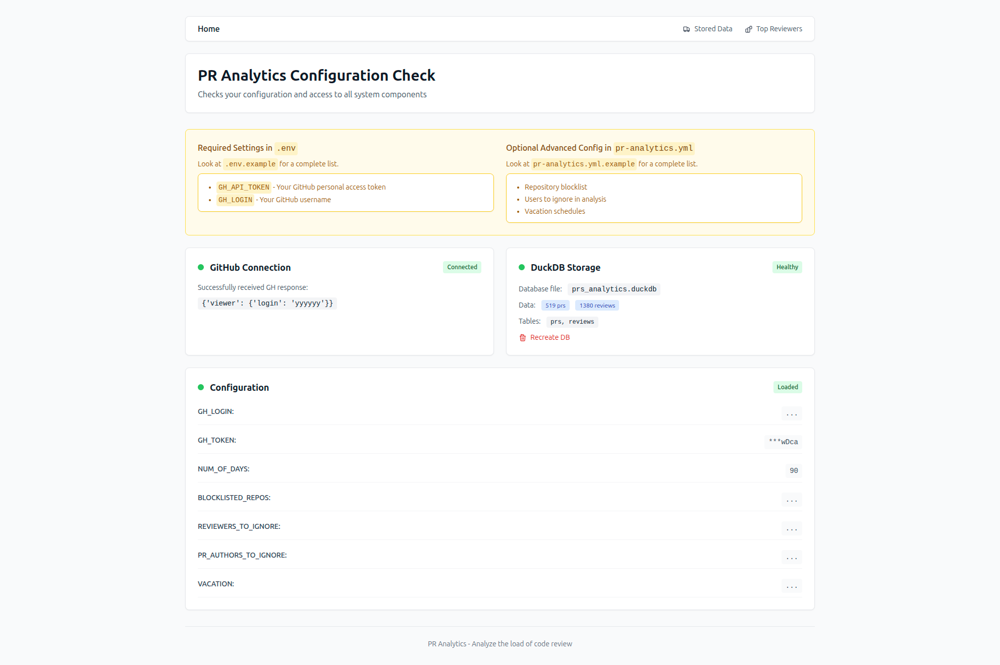
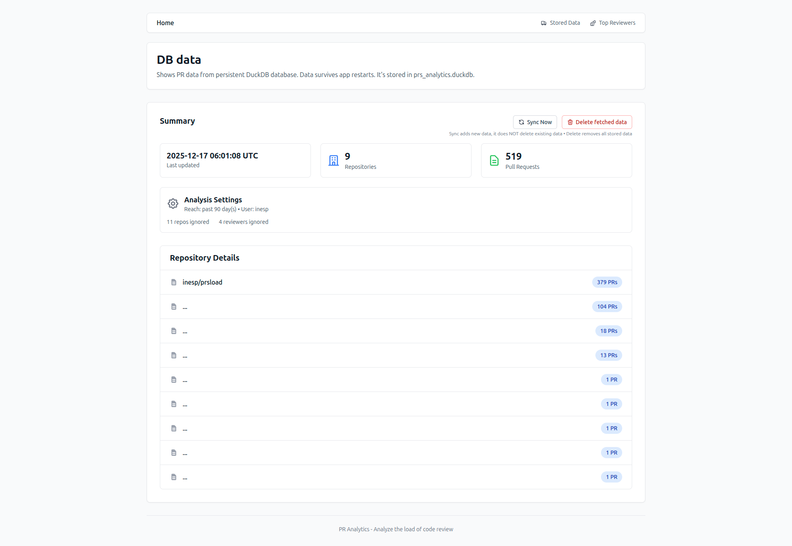
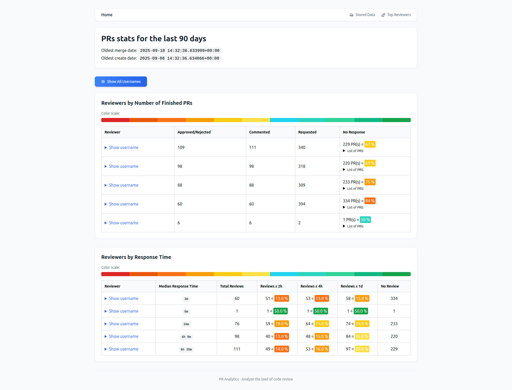

# PR Analytics

## Quick Start

1. **Setup Configuration**: Create a `.env` file in the project root:
```bash
GH_API_TOKEN=your_github_token_here
GH_LOGIN=your_github_username
```

Get your [API access token from GitHub](https://github.com/settings/tokens).

2. **Start the application**:
```bash
make build up
```

3. Open home at: [http://127.0.0.1:1234/](http://127.0.0.1:1234/) and check that settings are working. 



4. Open DB overview [http://localhost:1234/db_view](http://localhost:1234/db_view) and click "Sync Now".


5. Wait for a loooooooooooooooooong time.

6. Open the page [http://127.0.0.1:1234/top_reviewers](http://127.0.0.1:1234/top_reviewers).

  You should see something like:
  

## How it works

1. **Sync from GitHub**: Fetches PR and review data from your GitHub organization
2. **Local Storage**: Data is cached in a persistent DuckDB file (`prs_analytics.duckdb`)
3. **Analytics**: SQL queries provide insights into the load of PR reviewing

## Development

### Option 1: Docker (simplest, but annoying)
Everything runs in containers - no local setup needed:
```bash
make build up
```

### Option 2: Local Development (not annoying)
Run Flask locally for faster development:
```bash
make up-local
```

Dependencies are managed with `uv`.

### Configuration Files

- **`.env`** - Environment variables (secrets, basic config)  
- **`pr-analytics.yml`** - Advanced configuration (optional)

See `.env.example` and `pr-analytics.example.yml` for examples.

## Data Inspection

The application stores data in `prs_analytics.duckdb` using DuckDB's binary columnar format. Here are ways to inspect the data:

### Option 1: DuckDB CLI (Recommended)
Install and use the DuckDB command-line interface:
```bash
# Download DuckDB CLI
curl -L https://github.com/duckdb/duckdb/releases/latest/download/duckdb_cli-linux-amd64.zip -o duckdb.zip
unzip duckdb.zip && chmod +x duckdb

# Connect to database
./duckdb prs_analytics.duckdb
```

Run SQL queries to inspect data:
```sql
-- Show tables
.tables

-- Check schemas
DESCRIBE prs;
DESCRIBE reviews;

-- Sample data
SELECT * FROM prs LIMIT 5;
SELECT * FROM reviews LIMIT 5;

-- Analytics
SELECT repo_slug, COUNT(*) as pr_count 
FROM prs 
GROUP BY repo_slug 
ORDER BY pr_count DESC;
```

### Option 2: Web Interface
Visit `/db_view` endpoint in the application to see summary statistics and repository data.

### Option 3: Python Script
```python
import duckdb
conn = duckdb.connect("prs_analytics.duckdb")
print(conn.execute("SELECT * FROM prs LIMIT 10").df())
conn.close()
```
