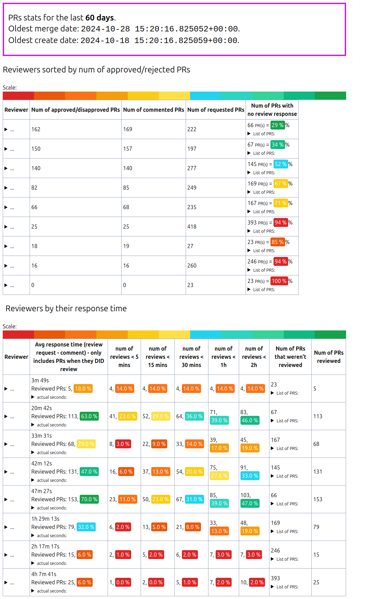

# See stats about PR reviews

Get an [API access token from GitHub](https://github.com/settings/tokens) and add it to your `settings.py` file (on root):
```
GH_API_TOKEN=gho_8765...............
GH_LOGIN=<your_github_login>
```

Start the code with 

```shell
make build up
```

Open the page [http://127.0.0.1:1234/top_reviewers](http://127.0.0.1:1234/top_reviewers).

You should see something like:



## Details:

We fetch a LOT of data and it can take several minutes. For this reason, we cache GH data in redis for this
`prsload/redis_prs.py::CACHE_DURATION` long.

For this reason the first load might be very slow, but consecutive page refresh will be much faster. BUT! it also
won't show latest data, but cached data.

There are a few things you can set in `.env`. All settings are collected in `prsload/prs_settings.py`.

## Development

Local env is handled by `uv`.

So, you can run `flask` **inside Docker** (via `make up`) or you can run it 
**locally** with `make up-redis up-flask-local`.

For Docker, you also need to call `make lock-to-requirements` (or `make build`) to update the `requirements.txt` file.

The `redis` url to connect to will be different if you are working inside or outside Docker.
Inside Docker the host is `redis` and outside it is `localhost`.
